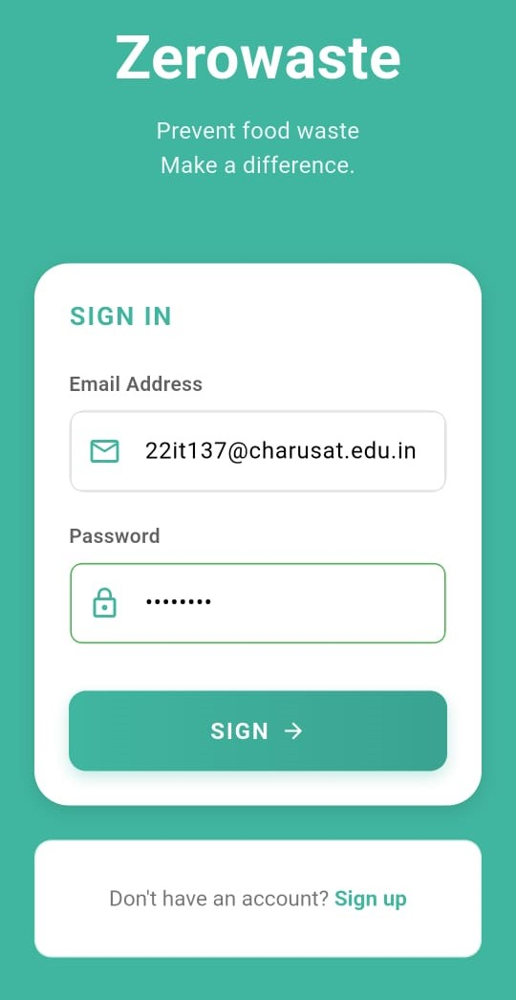
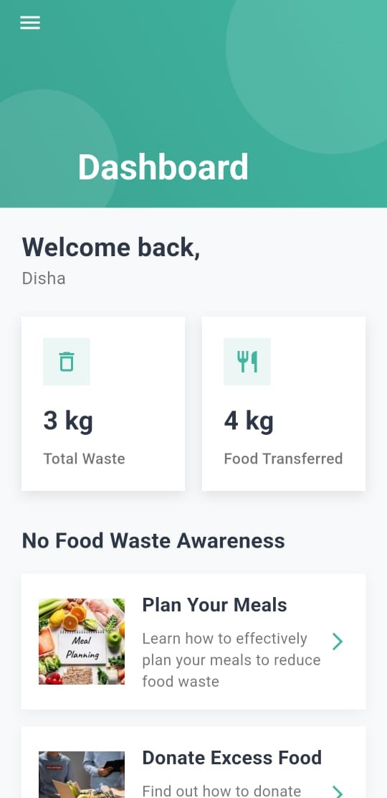
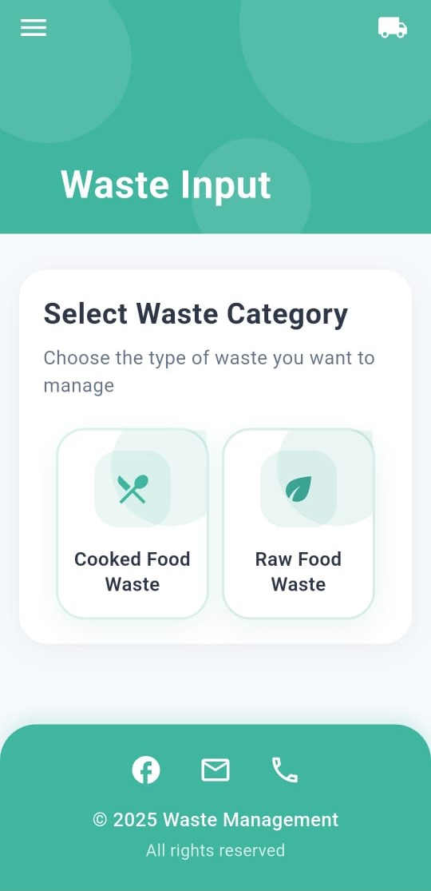
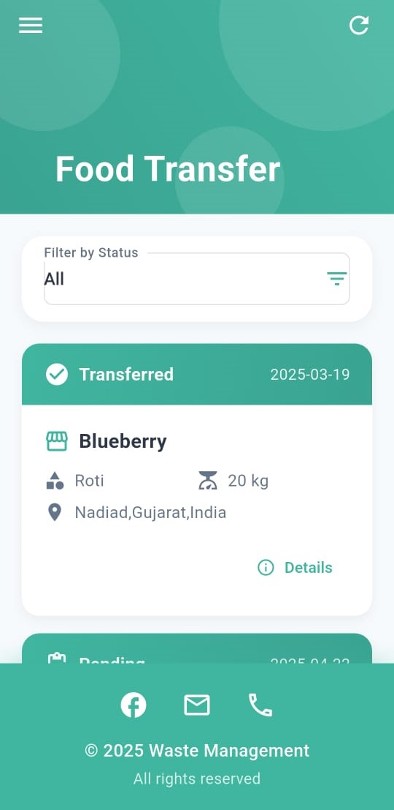
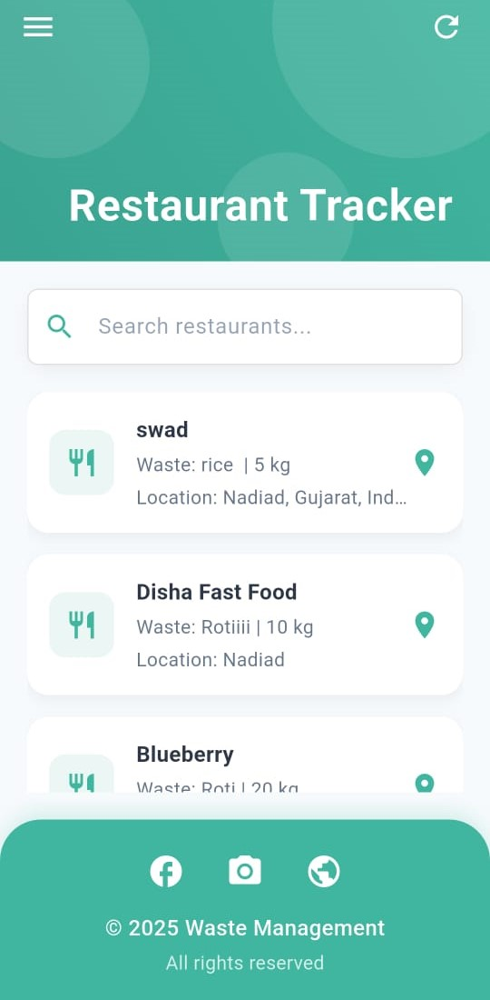
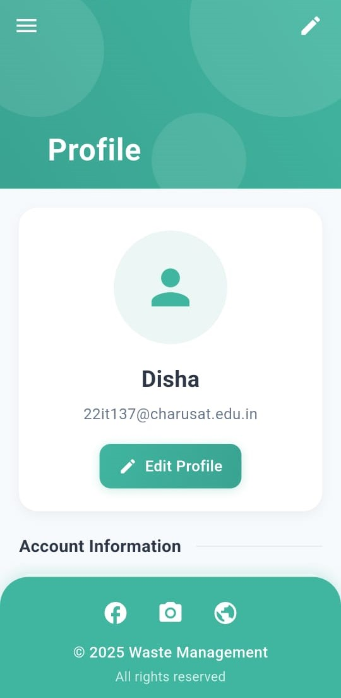

# ♻️ Waste Management Flutter App

A cross-platform Flutter application for restaurants to manage and reduce food waste. The app enables logging of food waste (cooked and raw), food transfers to NGOs, detailed waste reports, restaurant-wise tracking, and customizable profile and settings features.

---

## 📱 Features

### ✅ Authentication
- Email & Password login using Firebase
- Secure session handling
- Reset password support

### 📊 Dashboard
- Summary of total food waste
- Quick links to reports, input, and tracking

### 📝 Waste Input
- Add entries for:
  - Cooked food waste
  - Raw food waste
- Edit and delete functionality before submission
- Categorized data input with real-time storage

### 🔁 Food Transfer Record
- Record surplus food donations
- Real-time tracking of transfers to NGOs/recipients

### 📈 Reports
- Historical food waste data
- Filter by category and date
- Chart view of waste trends

### 🧭 Restaurant Tracker
- Track waste generated per branch
- Visual insights into waste frequency

### 🙍‍♂️ Profile & ✏️ Edit Profile
- View and edit user details
- Profile image update
- Firebase-auth linked identity

### ⚙️ Settings
- Dark/Light theme toggle
- Language selection:
  - English
  - Hindi
  - Gujarati

## ⚙️ Setup Instructions

### Prerequisites
- Flutter SDK
- Firebase project setup

### 📸 Screenshots

## How To Start
- Flutter pub get
- Flutter Run

